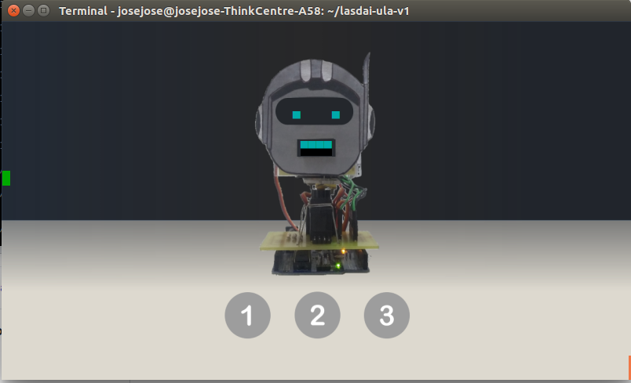

# LRS1
**Simulador LaSDAI Robot Social 1 (LRS1) - un robot social de bajo costo**

MVP del simulador [LRS1](https://youtu.be/GA42PbvoQ88), construido en la ***terminal Xfce*** de Linux  tiene como finalidad motivar el aprendizaje de la asignatura programación 1 mediante la programación del simulador. 

> Ver articulo relacionado [(Perez, J y Castro, J, 2018)](https://www.researchgate.net/publication/329116387_LRS1_UN_ROBOT_SOCIAL_DE_BAJO_COSTO_PARA_LA_ASIGNATURA_PROGRAMACION_1).

## Instalación
**1.** Modificar la linea del archivo **Makefile** de acuerdo al sistema operativo:

- Linux 32bits:
```sh
 biblioteca = 32bits
```
-   Linux 64bits:
```sh
 biblioteca = 64bits
```
**2.** Compilar y ejecutar el archivo **instalar** para descargar: *espeak*, *mplayer* y *xfce4-terminal*
```sh
$ make instalar
$ sudo make ./instalar
$ rm instalar
```
## Ejecutar el simulador
-   Abrir la **terminal xfce4**
-   Acceder a la carpeta que contiene el archivo **Makefile**
-   Ejecutar las siguientes lineas de comando
```sh
$ make LRS1-V1 ejemplo1
$ ./LRS1-V1
```
-   Abrir otra **terminal linux**
-   Ejecutar la siguiente linea de comando
```sh
$ ./ejemplo1
```
LISTO. El simulador debe decir **Hola Mundo** 
## Captura del simulador LRS1


 # Contenido de ejemplos
- Ejemplo1 : envía información hacia el robot "Hola mundo"
- Ejemplo2 : recibe información del robot
- Ejemplo3 : recibe información de otro computador y la envía al robot (Proximamente)
- Ejemplo4 : envía información hacia el robot desde otro pc (Proximamente)
- Ejemplo5 : presentación de LRS1
- Ejemplo6 : Voces del robot
- Ejemplo7 : Juego de operaciones matemáticas

## Tareas por realizar

1) Teleoperar el robot desde el mismo computador
2) Recibir información del robot desde otro computador
3) Estbalecer estructura de un proyecto
5) Cerrar la comuniciación del socket con desconectarRobot()
6) Realizar multiples pruebas 


